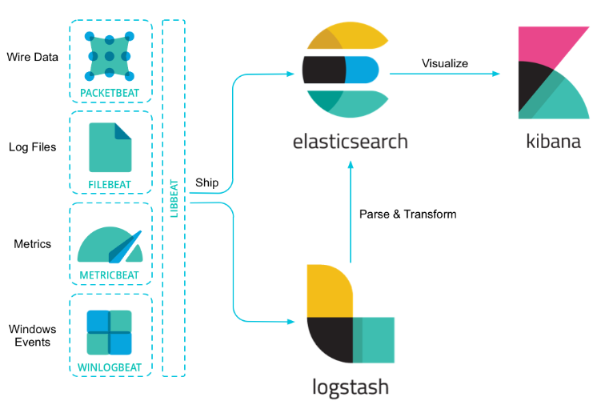

# Elasticsearch学习笔记
  
## elasticsearch.yml
  
### 基本配置：
  
1. cluster.name: your cluster name，
  
2. node.name: ES所在的node的名称,可设可不设,集群时建议必设,这样ES产生的日志会更容易的让你从哪个节点中找问题,
              如果不设置的话,每次启动节点名称都是不一样的,es的日志就会混乱。
  
2. path.data: ES数据存放的目录，多目录以逗号分割，注：数据目录不要在安装目录下，这样升级ES的时候，
              数据可以保存下来，避免误操作导致数据丢失。日志和插件目录一样。
		      数据多目录官方解释：数据可以保存到多个不同的目录， 如果将每个目录分别挂载不同的硬盘，这可是一个简单且高效实现一个软磁盘阵列（ RAID 0 ）的办法。Elasticsearch 会自动把条带化（注：RAID 0 又称为 Stripe（条带化），在磁盘阵列中,数据是以
              条带的方式贯穿在磁盘阵列所有硬盘中的） 数据分隔到不同的目录，以便提高性能。
  
4. path.logs:日志目录
5. path.plugins:插件目录
  
6. discovery.zen.minimum_master_nodes：最小主节点数（法定个数就是 ( master 候选节点个数 / 2) + 1）
			此设置有助于防止一个集群出现多个master争夺控制劝导致的数据不完整（建议三个节点以上）
			集群运行时使用以下命令修改：
  
        PUT /_cluster/settings
			{
				"persistent" : {
					"discovery.zen.minimum_master_nodes" : 2
				}
			}
  
		动态的去修改，不需要重启集群，当你添加和删除 master 节点的时候，你需要更改这个配置。
  
### 集群恢复方面的配置：
  
1. gateway.recover_after_nodes：重启集群时，集群中存在最少几个节点时，开始恢复数据
2. node.master: false 是否可作为msater,注意集群中可作为master即为后选节点
3. gateway.expected_nodes: 我的集群期望有几个节点（集群已存在的节点）
4. gateway.recover_after_time: 重启时愿意等待多久，超出这个时间后即时没达到期望也开始恢复数据。
  
### 集群配置：
  
1. discovery.zen.ping.unicast.hosts：["host1", "host2:port"]
> 官网介绍，默认是单播，即机器只要和上述中的node节点中的一个连接上，就可以联系到master节点，并加入集群，所以上述可以不用列出集群内所有节点。

### 安全配置
有一些设置是敏感的，通过文件系统的权限来保护是不足够的。基于这种场景，elasticsearch提供了一个keystore，可以通过密码保护。elasticsearch-keystore就是用来管理与设置keystore的工具。
- 所有的指令都必须使用运行elasticsearch的用户来执行。
- 只有部分设置被设计为从keystore读取。请一一参阅设置项文档，以查看其是否为keystore支持的那部分设置。

1. 创建keystore

使用create指令来创建elasticsearch.keystore：
```
bin/elasticsearch-keystore create
elasticsearch.keystore文件将被创建在elasticsearch.yml文件的旁边。
```
2. 列出keystore的配置
```
使用list指令来列出elasticsearch.keystore的设置：
bin/elasticsearch-keystore list
```
3. 添加一个String设置
```
一些敏感的字符串，像云平台插件的一个认真参数，可以通过add指令来添加：
bin/elasticsearch-keystore add the.setting.name.to.set
工具将提示这个值得设置。如果要通过控制台展示，使用--stdin参数：
cat /file/containing/setting/value | bin/elasticsearch-keystore add --stdin the.setting.name.to.set
```
4. 删除设置
```
使用remove指令来从keystore中删除配置：
bin/elasticsearch-keystore remove the.setting.name.to.remove
```
## jvm.options
  
	启动空间不足时，修改该文件的启动空间，默认2g
		-Xms512M
		-Xmx512M						

## [快照与还原](snapshot.html)

## Elasticsearch升级

### [滚动升级](roll_update.html)

### [全集群升级](all_cluster_update.html)

### [索引重建升级](reindex_update.html)

## [Elasticsearch停机](stop_elasticsearch.html)

## Elasticsearch相关知识
  
-	Elasticsearch：集群中的节点通过端口 9300 彼此通信。如果这个端口没有打开，节点将无法形成一个集群。
-	Elasticsearch 尽可能地屏蔽了分布式系统的复杂性。这里列举了一些在后台自动执行的操作：
	    ①分配文档到不同的容器 或 分片 中，文档可以储存在一个或多个节点中
		②按集群节点来均衡分配这些分片，从而对索引和搜索过程进行负载均衡
		③复制每个分片以支持数据冗余，从而防止硬件故障导致的数据丢失
		④将集群中任一节点的请求路由到存有相关数据的节点
		⑤集群扩容时无缝整合新节点，重新分配分片以便从离群节点恢复
  
### Elasticsearch 集群健康：
  
  
		 curl -XGET 'localhost:9200/_cluster/health?pretty'
		 {
		  "cluster_name" : "v_tlonghe",
		  "status" : "yellow",  //green 所有的主分片和副本分片都正常运行。 yellow 所有的主分片都正常运行，但不是所有的副本分片都正常运行。red 有主分片没能正常运行。
		  "timed_out" : false,
		  "number_of_nodes" : 1,
		  "number_of_data_nodes" : 1,
		  "active_primary_shards" : 15,
		  "active_shards" : 15,
		  "relocating_shards" : 0,
		  "initializing_shards" : 0,
		  "unassigned_shards" : 15,
		  "delayed_unassigned_shards" : 0,
		  "number_of_pending_tasks" : 0,
		  "number_of_in_flight_fetch" : 0,
		  "task_max_waiting_in_queue_millis" : 0,
		  "active_shards_percent_as_number" : 50.0
		}
  
### Elasticsearch 索引
  
		索引：实际上是指向一个或者多个物理分片的逻辑命名空间。
  
		分片：
            ①一个分片是一个底层的工作单元它仅保存了全部数据中的一部分，一个分片是一个Lucene的实例，以及它本身就是一个完整的搜索引
            擎。
            ②Elasticsearch 是利用分片将数据分发到集群内各处的。分片是数据的容器，文档保存在分片内，分片又被分配到集群内的各个节点
            里。
            ③当你的集群规模扩大或者缩小时， Elasticsearch 会自动的在各节点中迁移分片，使得数据仍然均匀分布在集群里。
            ④一个分片可以是 主 分片或者 副本 分片。 索引内任意一个文档都归属于一个主分片，所以主分片的数目决定着索引能够保存的最大
            数据量。一个主分片最大能够存储 Integer.MAX_VALUE - 128 个文档，但是实际最大值还需要参考你的使用场景。
            ⑤在索引建立的时候就已经确定了主分片数，但是副本分片数可以随时修改。
  
### 增大吞吐量：
  
		读操作——搜索和返回数据——可以同时被主分片 或 副本分片所处理，所以当你拥有越多的副本分片时，也将拥有越高的吞吐量。
  
### CURL中请求的pretty含义：
  
		在请求的查询串参数中加上 pretty 参数， 正如前面的例子中看到的，这将会调用 Elasticsearch 的 pretty-print 功能，该功能 使
        得 JSON 响应体更加可读。
  
### index内字段含义：
  
		_id:自动生成的 ID 是 URL-safe、 基于 Base64 编码且长度为20个字符的 GUID 字符串。 这些 GUID 字符串由可修改的 FlakeID 模
        式生成，这种模式允许多个节点并行生成唯一 ID ，且互相之间的冲突概率几乎为零。
		_version:每个doc都有一个，当这个doc被修改时，_version变化

### 词汇表
- analysis（分析）
Analysis（分析）是将 full text（全文）转化为 terms（词条）的过程。使用不同的 analyzer（分词器）， FOO BAR，Foo-Bar，foo，bar 这些短语可能都会生成 foo 和 bar 两个词条，实际的 index（索引）里面存储的就是这些 terms（词条）。针对 FoO:bAR 的 full text query（全文检索），会先将其分析成为 foo,bar 这样的词条，然后匹配存储在 index（索引）中的 term（词条）。正是这个 analysis（分析）的过程（发生在索引和搜索时）使得 elasticsearch 能够执行 full text queries（全文检索）。也可以参阅 text（文本）和 term（词条）了解更多细节信息。
- cluster （集群）
cluster（集群）是由拥有同一个集群名的一个或者多个节点组成。每个集群拥有一个主节点，它由集群自行选举出来，在当前主节点挂了，能被其他节点取代。
- document （文档）
document（文档）是存储在elasticsearch中的json文档。类似于关系型数据库中的一行记录。每个文档存储在一个index（索引）中，它具有一个type（类型）和一个id。文档是包含零到多个fields（属性）或者键值对的json对象（类似于其他语言中的hash/hashmap/associative array）。当一个文档被indexed（索引）的时候，它的原始json文档会被存储成_source属性，对该文档进行get或者search操作时，默认返回的就是改属性。
- id 
文档的ID标识一个文档。文档的index/type/id必须唯一。如果没有提供ID，elasticsearch会自动生成一个ID。（查询routing（路由）获取更多信息）
- field（属性） 
一个文档包涵一系列的属性或者键值对。它的值可以是简单标量值（如字符串，整型数，日期），或者是像数组和对象一样的嵌套结构。属性类似于关系型数据库中的列。每个属性的mapping（映射）都有其类型（不同于document（文档）的type（类型）），表明该属性能存储成改类型的数据，例如 integer, string, object。mapping（映射）也允许你定义属性的值是否需要analyzed（分词）。
- index （索引）
index（索引）类似于关系型数据库中的表。它有一个mapping（映射）来定义索引中的fields（属性），这些属性被分组成多种type（类型）。索引是一个逻辑命名空间，它对应一到多个primary shards（主分片）和零到多个replica shards（副本分片）。
- mapping （映射）
mapping（映射）类似于关系型数据库中的元数据定义。每一个index（索引）对应一个mapping（映射），它定义了index（索引）中的每一个type（类型），另外还有一些索引级别的设置。mapping（映射）可以显式定义，或者当一个文档进行索引时自动生成。
- node （节点）
node（节点）是从属于一个elasticsearch集群的正在运行的节点。当以测试为目的时，可以在一台主机上启动多个节点，但是通常一台主机最好运行一个节点。在启动时，节点会使用广播的方式，自动感知（网络中）具有相同集群名的集群，并尝试加入它。
- primary shard （主分片）
每个文档存储在单primary shard （主分片）中。当索引一个文档时，它会首先被索引到主分片上，然后索引到主分片的所有副本上。默认情况下，一个index（索引）有5个primary shard （主分片）。根据index（索引）的处理能力，你可以指定更少或者更多的primary shard （主分片）来扩展文档数量。当index（索引）创建之后，primary shard （主分片）的数量不可更改。查询routing（路由）获取更多信息。
- replica shard （副本分片）
每一个primary shard （主分片）拥有零到多个副本。副本是primary shard （主分片）的拷贝，它的存在有两个目的：
增加容错：当主分片失败时，一个replica shard（副本分片）可以提升为primary shard （主分片）
提升性能：primary shard （主分片）和replica shard（副本分片）都能处理get和shearch请求。默认情况下，每个primary shard （主分片）有一个副本，副本的个数可以动态的修改。replica shard（副本分片）不会和primary shard （主分片）分配在同一个节点上。
- routing （路由）
 index（索引）一个document（文档）时，它会存储在一个primary shard （主分片）上。通过对routing（路由）值作哈希来决定具体是哪一个主分片。默认情况下，routing（路由）值是由document（文档）ID派生的，如果document（文档）指定了父document（文档），则通过其父document（文档）的ID派生（保证父子文档存储在同一个分片上）。routing（路由）值可以在索引时直接指定，或者在mapping（映射）中指定一个routing field（路由属性）。
- shard （分片）
shard（分片）是一个Lucene实例。它是由elasticsearch管理的低层次的工作单元。index（索引）是针对 主分片和副本分片的逻辑命名空间。除了定义index（索引）应该具有的primary shard（主分片）和replica shard（副本分片）的数量之外，你不需要对shard（分片）作其它的工作。相反，你的代码应该只处理index（索引）。elasticsearch将shards（分片）分配到整个集群的所有节点上，当节点失败时可以自动将分片迁移到其他节点或者新增的节点上。
- source field （源属性）
在默认情况下，你索引的json document（文档）会存储在_source field（属性）中，get和search请求会返回该field（属性）。这样可以直接在搜索结果中获取原始文档对象，不需要通过ID再检索一次文档对象。
- term （词条）
term（词条）是elasticsearch中被索引的确切值。foo, Foo, FOO 这些term（词条）不相等。term（词条）可以通过词条搜索来检索。查询text（文本）和anaylsis（分词）获取更多信息。
- text （文本）
text（文本）（或者说全文）是普通的非结构化文本，如一个段落。默认情况下，text（文本）会被analyzed（分词）成term（词条），term（词条）是在索引中存储的确切值。文本的field（属性）必须在索引时完成analyzed（分词）来支持全文检索的功能，全文检索使用的关键词也必须在搜索时analyzed（分词）成索引时产生的相同term（词条）。查询term（词条）和analysis（分词）获取更多信息。
- type （类型）
type（类型）代表文档的类型，如一封邮件，一个用户，一条推文。搜索API可以通过文档类型来过滤。index（索引）可以包涵多个类型，每一个type（类型）有一系列的fields（属性）。同一个index（索引）中不同type（类型）的同名fields（属性）必须使用相同的mapping（映射）（定义文档的属性如何索引以及是文档能被搜索）。
  
### 处理更新文档的冲突：
  
		每个文档都有一个_version,在我们修改时，可以把_version做为条件。例：
  
			PUT /website/blog/1?version=1 
			{
			  "title": "My first blog entry",
			  "text":  "Starting to get the hang of this..."
			}
  
		修改时，Elasticsearch判断_version>old_version？我们能修改成功:返回错误信息，status：409
  
### Elasticsearch索引分片
  
		如何确定分配到哪个分片？
  
			shard = hash(routing) % number_of_primary_shards
			routing:一个可变值，默认是文档的_id
			number_of_primary_shards:主分片的数量
  
			注：这就解释了为什么我们要在创建索引的时候就确定好主分片的数量 并且永远不会改变这个数量：因为如果数量变化了，那么所有之
            前路由的值都会无效，文档也再也找不到了。
  
### [新建、索引和删除文档](基本的CURL命令.html )
  
		这些都是写操作，主分片都要求分片副本处于活跃状态达到一定数量，才会执行，避免发送网络分区故障的时候进行写操作，
        进而导致数据不一致。
		consistency = int( (primary + number_of_replicas) / 2 ) + 1
		如果没有足够的，那么会一直等待，直到满足或者timeout
  
### Elasticsearch查询
  
		精确值很容易查询。结果是二进制的：要么匹配查询，要么不匹配。
		查询全文数据要微妙的多。我们问的不只是“这个文档匹配查询吗”，而是“该文档匹配查询的程度有多大？”
  
### Elasticsearch分析
  
		个人建议：不确定做全文查询（即按匹配度返回结果）的字段，全部都不去分析，减少存储空间，减少token
  
### Elasticsearch评分查询与过滤的区别
  
		评分查询：不仅仅要找出 匹配的文档，还要计算每个匹配文档的相关性，结果不缓存
		过滤：只是简单的检查包含或者排除，结果少且结果缓存
		如何选择查询与过滤编辑
		    通常的规则是，使用 查询（query）语句来进行 全文 搜索或者其它任何需要影响 相关性得分 的搜索。除此以外的情况都使用过滤
            （filters)。
  
### Elasticsearch查询语法：
  
		1.match_all:查询所有；
		2.match：全文搜索时，会根据查询的字段是否分析而去判断是否分析查询字符串，精确查询时，精确匹配
		3.term：用于精确值匹配
		4.terms：类似sql中的in
		5.exists、missing：用于查找指定字段有没有值
		  注：boost：1（default），查询时可以增加该字段修改权重
  
### Elasticsearch处理NULL值
  
		首先了解Lucene一些概念：
			Document:  它是在索引和搜索过程中数据的主要表现形式，或者称“载体”，承载着我们索引和搜索的数据,它由一个或者多个域(Field)组成。
			Field:   它是Document的组成部分，由两部分组成，名称(name)和值(value)。
			Term:  它是搜索的基本单位，其表现形式为文本中的一个词。
			Token:  它是单个Term在所属Field中文本的呈现形式，包含了Term内容、Term类型、Term在文本中的起始及偏移位置。
		所以如果字段不存在，也就无法在倒排索引结构中表现，无法存于倒排索引中。
		对于这一类数据的查询，使用exists、missing
			exists：返回那些在指定字段有任何值的文档（is not null）
			missing：返回某个特定 _无_ 值字段的文档(is null)
		我们可以选择将显式的 null 值替换成我们指定 占位符（placeholder） 。在为字符串（string）、数字（numeric）、布尔值
        （Boolean）或日期（date）字段指定映射时，同样可以为之设置 null_value 空值，用以处理显式 null 值的情况。
  
### Elasticsearch缓存：
  
		只缓存非评分查询，且文档数超过10000或超过总文档数量的3%才会被缓存
		缓存的剔除规则：缓存满时，最近最少被使用将被剔除
  
### Elasticsearch数据建模：
  
#### 关联关系处理：
  
①应用层关联 ②非规范化数据 ③嵌套对象 ④父子关系文档
  
-①应用层关联：索引之间，通过类似于主键进行关联，在应用层面，通过上一个索引的返回结果，座位后一个查询的条件，得到最终结果。优点是数据标准化，缺点是会有额外的查询。
-②非规范化数据：即冗余一定的数据。优点是速度快，缺点数据冗余，非规范。
-③嵌套对象：允许将一个对象实体和另外一个对象实体关联起来存在一个文档中。优点：由于所有的信息都在一个文档中,当我们查询时就没有必要去联合文章和评论文档,查询效率就很高。缺点：可能造成数据冗余，嵌套文档是隐藏存储的,我们不能直接获取。如果要增删改一个嵌套对象,我们必须把整个文档重新索引才可以。值得注意的是,查询的时候返回的是整个文档,而不是嵌套文档本身。
-④父子关系文档：类似于嵌套对象，区别在于父对象和子对象都是完全独立的文档。优点：更新父文档时，不会重新索引子文档;创建，修改或删除子文档时，不会影响父文档或其他子文档。这一点在这种场景下尤其有用：子文档数量较多，并且子文档创建和修改的频率高时;子文档可以作为搜索结果独立返回.限制：父文档和其所有子文档，都必须要存储在同一个分片中;父子文档创建时间点：1）创建 索引时；2）在子文档 type 创建之前指定 mapping中的_parent，子文档创建时需要指明父文档的ID（确保父子文档在同一个分片）如果你想要改变一个子文档的 parent 值，仅通过更新这个子文档是不够的，因为新的父文档有可能在另外一个分片上。因此，你必须要先把子文档删除，然后再重新索引这个子文档。官网建议：当文档索引性能远比查询性能重要 的时候，父子关系是非常有用的，但是它也是有巨大代价的。其查询速度会比同等的嵌套查询慢5到10倍!
  
#### 扩容
  
 >   一个分片即一个lucene索引，一个Elasticsearch索引即一系列分片的集合。
  
  
	索引扩容很麻烦，所以需要预设索引的分片数量。
  
__分片数量的考量规则：__
  
-	一个分片的底层即为一个 Lucene 索引，会消耗一定文件句柄、内存、以及 CPU 运转。
-	每一个搜索请求都需要命中索引中的每一个分片，如果每一个分片都处于不同的节点还好， 但如果多个分片都需要在同一个节点上竞争使用相同的资源就有些糟糕了。
-	用于计算相关度的词项统计信息是基于分片的。如果有许多分片，每一个都只有很少的数据会导致很低的相关度。
  
__容量规划：__
  
>如果一个分片太少而 1000 个又太多，那么我怎么知道我需要多少分片呢？ 一般情况下这是一个无法回答的问题。因为实在有太多相关的因素了：你使用的硬件、文档的大小和复杂度、文档的索引分析方式、运行的查询类型、执行的聚合以及你的数据模型等等。
幸运的是，在特定场景下这是一个容易回答的问题，尤其是你自己的场景：
基于你准备用于生产环境的硬件创建一个拥有单个节点的集群。
创建一个和你准备用于生产环境相同配置和分析器的索引，但让它只有一个主分片无副本分片。
索引实际的文档（或者尽可能接近实际）。
运行实际的查询和聚合（或者尽可能接近实际）。
基本来说，你需要复制真实环境的使用方式并将它们全部压缩到单个分片上直到它“挂掉。” 实际上 挂掉 的定义也取决于你：一些用户需要所有响应在 50 毫秒内返回；另一些则乐于等上 5 秒钟。
一旦你定义好了单个分片的容量，很容易就可以推算出整个索引的分片数。 用你需要索引的数据总数加上一部分预期的增长，除以单个分片的容量，结果就是你需要的主分片个数。
  
__扩容：__
  
>当你需要在不停服务的情况下增加容量时，下面有一些有用的建议。相较于将数据迁移到更大的索引中，你可以仅仅做下面这些操作：
① 创建一个新的索引来存储新的数据。
② 同时搜索两个索引来获取新数据和旧数据。
实际上，通过一点预先计划，添加一个新索引可以通过一种完全透明的方式完成，你的应用程序根本不会察觉到任何的改变。
在索引别名和零停机，我们提到过使用索引别名来指向当前版本的索引。
  
__负载均衡（例子 场景：起始两个节点，后增加一个节点）__
  
>搜索性能取决于最慢的节点的响应时间，所以尝试均衡所有节点的负载是一个好想法。 如果我们只是增加一个节点而不是两个，最终我们会有两个节点各持有一个分片，而另一个持有两个分片做着两倍的工作。
我们可以通过调整副本数量来平衡这些。通过分配两份副本而不是一个，最终我们会拥有六个分片，刚好可以平均分给三个节点
```
PUT /my_index/_settings
{
  "number_of_replicas": 2   //修改副本数
}
```
  
__按时间粒度建索引__
- 按天建索引，即时间后缀不同
- 索引时，可以在应用层，直接根据索引名索引数据
- 按时间粒度创建索引时，可以使用别名，通过add和remove修改别名指向的索引，这样应用层就不需要特殊处理
```
POST /_aliases
{
  "actions": [
    { "add":    { "alias": "logs_current",  "index": "logs_2014-10" }}, 
    { "remove": { "alias": "logs_current",  "index": "logs_2014-09" }}, 
    { "add":    { "alias": "last_3_months", "index": "logs_2014-10" }}, 
    { "remove": { "alias": "last_3_months", "index": "logs_2014-07" }}  
  ]
}
```
  
__索引模版__
  
```
PUT /_template/my_logs ①
{
  "template": "logstash-*",   ②
  "order":    1,    ③
  "settings": {
    "number_of_shards": 1    ④
  },
  "mappings": {
    "_default_": {    ⑤
      "_all": {
        "enabled": false
      }
    }
  },
  "aliases": {
    "last_3_months": {}    ⑥
  }
}
```
>①创建一个名为 my_logs 的模板。
②将这个模板应用于所有以 logstash- 为起始的索引。
③这个模板将会覆盖默认的 logstash 模板，因为默认模板的 order 更低。
④限制主分片数量为 1 。
⑤为所有类型禁用 _all 域。
⑥添加这个索引至 last_3_months 别名中。
  
__索引优化__
  
- 段合并   参考optimize API
- 关闭旧索引
- 归档旧索引
  
### 部署
  
__日志记录__
- 日志记录级别调整
```
  
PUT /_cluster/settings
{
    "transient" : {
        "logger.discovery" : "DEBUG"
    }
}
避免使用 TRACE 。这个级别非常的详细，详细到日志反而不再有用了。
```
```
PUT /_cluster/settings
{
    "transient" : {
        "logger.index.search.slowlog" : "DEBUG",   ①
        "logger.index.indexing.slowlog" : "WARN"   ②
    }
}
```
>①设置搜索慢日志为 DEBUG 级别。
②设置索引慢日志为 WARN 级别。
  
- 慢日志
```
PUT /my_index/_settings
{
    "index.search.slowlog.threshold.query.warn" : "10s",    ①
    "index.search.slowlog.threshold.fetch.debug": "500ms",    ②
    "index.indexing.slowlog.threshold.index.info": "5s"    ③
}
```
> ①查询慢于 10 秒输出一个 WARN 日志。
②获取慢于 500 毫秒输出一个 DEBUG 日志。
③索引慢于 5 秒输出一个 INFO 日志。
  
### Elasticsearch升级，重启，备份，快照方式请参考官网
  
https://www.elastic.co/guide/cn/elasticsearch/guide/current/_rolling_restarts.html
  
  
# Elasticsearch日志平台：ELK Stack（Elasticsearch、Beats、logstash、kibana）
  
  

  
## 介绍
  
__Kibana__:够以图表的形式呈现数据，并且具有可扩展的用户界面，供您全方位配置和管理 Elastic Stack
  
__Beats__:Beats 是轻量型采集器的平台，从边缘机器向 Logstash 和 Elasticsearch 发送数据。
  
__Logstash__:Logstash 是动态数据收集管道，拥有可扩展的插件生态系统，能够与 Elasticsearch 产生强大的协同作用。可以对数据进行format
  
[详细介绍](https://www.elastic.co/guide/en/logstash/current/deploying-and-scaling.html#deploying-and-scaling )
  
  
  
## kibana安装
  
	1.下载解压，修改\config\kibana.yml 中的elasticsearch.url
		如果Elasticsearch需要用户名密码访问，则设置
					#elasticsearch.username: "user"
					#elasticsearch.password: "pass"
		还可设置端口号：server.port: 5601
	2.run kibana
	3.http://localhost:5601
  
## Beat安装
  
各种方式安装见官网：
https://www.elastic.co/guide/en/beats/filebeat/current/filebeat-installation.html
  
## Logstash安装
  
各种方式安装见官网：
https://www.elastic.co/guide/en/logstash/current/installing-logstash.html
  
  
## Beat
  
### Common Log Formats
  
  
> <font color=red>此功能处于测试阶段，可能会发生变化。设计和代码被认为比官方GA功能不成熟。弹性将采取最大的努力来解决任何问题，但测试版功能不受SLA官方功能的支持。</font>
  
__先决条件__
- [Elastic stack的安装与配置](https://www.elastic.co/guide/en/beats/libbeat/5.6/getting-started.html )
- [安装filebeat](https://www.elastic.co/guide/en/beats/filebeat/current/filebeat-installation.html )
- [安装Ingest Node GeolP和UserAgent插件](https://www.elastic.co/guide/en/beats/filebeat/current/filebeat-modules-quickstart.html#_prerequisites ) 
- Elasticsearch安装并启动
  
### [Command Line Options](https://www.elastic.co/guide/en/beats/filebeat/current/command-line-options.html#command-line-options )
  
  
### [Configuration Options](https://www.elastic.co/guide/en/beats/filebeat/current/filebeat-configuration-details.html )
  
__[示例文件点击查看](filebeat.full.yml)__
__[参考标准](https://www.elastic.co/guide/en/beats/libbeat/5.6/config-file-format.html)__


__filebeat.prospectors__
输入输出的配置
| field			| 描述		   | 
| ------------- |:-------------:| 
| input_type|①log：按行读取日志文件；②stdin：标准读取每次读取的数据都会被处理并发送|
|path|读取数据的存储路径，例:/var/log/*/*.log|
|encoding|编码设置(plain, latin1, utf-8, utf-16be-bom, utf-16be, utf-16le, big5, gb18030, gbk, hz-gb-2312,euc-kr, euc-jp, iso-2022-jp, shift-jis等，plain不验证和转换输入)|
|exclude_lines：[]|过滤不需要的行（正则）|
|include_lines：[]|过滤需要的行（正则）|
|exclude_files|要忽略的文件（正则）|
|close_inactive|启用此选项时，如果在指定的持续时间内未收集文件，Filebeat将关闭文件句柄。即在上一次读取文件后关闭的文件再打开，则会新开启harvester去读文件，建议值设置为一个大于日志文件最不频繁更新的值，副作用就是关闭harvester，新的日志行不会发送|
|ignore_older|忽略指定时间间隔之前修改的任何文件，避免重启时重复录入，值必须大于close_inactive|
|multiline|一次发送多行log|
|multiline.pattern| '^\['  //指定要匹配的正则表达式模式。|
|multiline.negate| true  //匹配pattern的结果执行match的方法|
|multiline.match| after  //匹配到的多行附加到未匹配的行的模式|
|multiline.max_lines|可以组合成一个事件的最大行数。如果多行消息包含多于一条max_lines，则任何其他行都将被丢弃。默认值为500|
|multiline.timeout|在指定的超时后，即使没有找到新的模式来启动新事件，Filebeat也会发送多行事件。默认值为5s|
|document_type|日志类型（debugLog，errotLog）,5.5以及之后已被启用，使用fields替代|
|scan_frequency|轮询间隔时间|
|tags|Beat在tags每个已发布事件的字段中包含的标签列表。标签可以轻松地选择Kibana中的特定事件或在Logstash中应用条件过滤|
|fields|可以指定的可选字段，以向输出添加附加信息，可以是标量值，数组，字典或这些的任何嵌套组合|
|fields_under_root|如果此选项设置为true，则自定义字段将作为顶级字段存储在输出文档中，而不是分组在 fields子字典下，如果自定义字段名称与Filebeat添加的其他字段名称冲突，则自定义字段将覆盖其他字段|
|注意一下字段的设置|必须在了解数据丢失的潜在副作用下进行设置|
|close_*|设置某一标准关闭harvester|
|close_inactive|启用此选项时，如果在指定的持续时间内未收集文件，Filebeat将关闭文件句柄，建议您设置close_inactive一个大于日志文件最不频繁更新的值|
|close_renamed|启用此选项时，Filebeat会在文件重命名时关闭文件处理程序|
|close_removed|启用此选项时，文件删除时Filebeat将关闭收割机|
|close_eof|启用此选项后，Filebeat会在文件结束后立即关闭文件，即文件一次写入，不更新，新数据以新文件形式存储|
|close_timeout|启用此选项后，Filebeat会为每个收割机提供预定义的生命周期，阅读文件将在close_timeout后停止，此选项对于较旧的日志文件可能会很有用，如果设置close_timeout为相等ignore_older，则在收割机关闭时修改文件将不会被选中。这种设置的组合通常会导致数据丢失，并且不会发送完整的文件。|
|clean_*|用于清理注册表文件中的状态条目。这些设置有助于减少注册表文件的大小，并可以防止潜在的[inode重用问题](https://www.elastic.co/guide/en/beats/filebeat/current/faq.html#inode-reuse-issue)|
|clean_inactive|启用此选项时，Filebeat会在指定的非活动时间段过去之后移除文件的状态,该clean_inactive设置必须大于ignore_older + scan_frequency确保在文件仍在收集时没有状态被删除|
|close_removed|启用此选项时，如果在磁盘上找不到文件，Filebeat将从注册表中清除文件。此设置不适用于已被移动到Filebeat仍然可见的另一个目录的重命名文件或文件。此选项默认启用。|
|harvester_buffer_size|每个收集器在获取文件时使用的缓冲区的大小（以字节为单位）。默认值为16384字节|
|max_bytes|单个日志消息可以具有的最大字节数。所有字节max_bytes都被丢弃并且不发送。此设置对于可能变大的多行日志消息特别有用。默认值为10MB（10485760）|
|关于json的配置以json开头|让Filebeat解码结构化为JSON消息的日志。Filebeat逐行处理日志，因此JSON解码仅在每行存在一个JSON对象时有效例json.keys_under_root：truekeys_under_root：true、son.add_error_key：trueadd_error_key：true、json.message_key：logmessage_key：log|
|json.keys_under_root|默认情况下，解码的JSON被放置在输出文档中的“json”键下。如果启用此设置，则将密钥复制到输出文档中的顶层。默认值为false|
|overwrite_keys|如果keys_under_root启用此设置，则解码的JSON对象的值将覆盖Filebeat正常添加的字段（type，source，offset等），以防发生冲突|
|json.add_error_key|如果启用此设置，Filebeat将在JSON解组错误或message_key在配置中定义但不能使用的情况下添加“json_error”键|
|json.message_key|一个可选的配置设置，用于指定应用线路过滤和多线设置的JSON密钥。如果指定该键，则必须位于JSON对象的顶层，与该关键字关联的值必须为字符串，否则不会发生过滤或多行聚合|
|tail_files|如果此选项设置为true，Filebeat将在每个文件的末尾开始读取新文件，而不是开头。当此选项与日志轮换结合使用时，可能会跳过新文件中的第一个日志条目。默认设置为false|
|pipeline |为此探测器生成的事件设置的Ingest Node流水线ID|
|symlinks |允许Filebeat除常规文件外还可以收集符号链接。收集符号链接时，即使报告了符号链接的路径，Filebeat也会打开并读取原始文件。|
|backoff |指定Filebeat如何积极地抓取打开的文件进行更新。在大多数情况下，您可以使用默认值。该backoff选项定义在达到EOF之后Filebeat等待再次检查文件的时间|
|max_backoff |在达到EOF之后再次检查文件之前Filebeat等待的最长时间|
|backoff_factor|此选项指定等待时间增加的速度|
|harvester_limit |限制一个探矿者并行启动的收割机数量|
|enabled |可以与每个探测器一起使用，以定义是否启用了探测器。默认情况下，enabled被设置为true|
  
__General Options__
name:beat name (default hostname)
  
__output__
  
[Elasticsearch](https://www.elastic.co/guide/en/beats/filebeat/current/elasticsearch-output.html#elasticsearch-output )
可指定索引模版以及索引
  
[Logstash](https://www.elastic.co/guide/en/beats/filebeat/current/logstash-output.html#logstash-output )
可指定索引
  
__[多行数据的处理例子](https://www.elastic.co/guide/en/beats/filebeat/current/multiline-examples.html )__
  
__[负载平衡](https://www.elastic.co/guide/en/beats/filebeat/current/load-balancing.html#load-balancing )__
  
__[官方提供正则表达式](https://www.elastic.co/guide/en/beats/filebeat/current/regexp-support.html#regexp-support )__
  
__[官方提供的可视化模版](https://www.elastic.co/guide/en/beats/filebeat/current/filebeat-modules.html#filebeat-modules )__
按照一定的模式存储的log，可以配置module，数据即可配合kibana，可视化监控
  

__harvester__
harvester负责逐行读取文件内容，并将文件输出；负责打开和关闭文件，所以在harvester处于运行状态时文件要保持打开状态，如果在harvester运行时删除或者重命名文件，Filebeat将继续阅读该文件，所以harvester关闭前需保留磁盘空间，默认情况下，Filebeat保持文件打开知道close_inactive到达。
>关闭harvester具有一下后果
①关闭文件处理程序，如果文件在收割机仍在读取文件时被删除，则释放底层资源。
②文件的收集只能在scan_frequency已经过去之后重新开始。
③如果在收割机关闭时移动或移除文件，则文件的收集将不会继续。

要控制harvester何时关闭，请使用close_*配置选项


__prospector__
prospector负责管理harvester并查找所有来源。
示例：
```
filebeat.prospectors:
- input_type: log
  paths:
    - /var/log/*.log
    - /var/path2/*.log
```
prospector类型:log和stdin。
prospector只能读取本地文件。没有连接到远程主机的功能来读取存储文件或日志。

__[FileBeat如何保持文件状态](https://www.elastic.co/guide/en/beats/filebeat/current/how-filebeat-works.html#_how_does_filebeat_keep_the_state_of_files)__

__[FileBeat如何确保一次交货](https://www.elastic.co/guide/en/beats/filebeat/current/how-filebeat-works.html#at-least-once-delivery)__

<font color=red>发送到输出但在Filebeat关闭之前未确认的任何事件将在Filebeat重新启动时重新发送。这样可以确保每个事件至少发送一次，但最终可能会将重复的事件发送到输出。您可以通过设置该shutdown_timeout选项，将Filebeat配置为等待一段特定的时间，然后再关闭。</font>

## Logstash
  
__[logstash.yml](https://www.elastic.co/guide/en/logstash/current/logstash-settings-file.html#logstash-settings-file )__


  
| 设置			| 描述				| 默认值	|
| ------------- |:-------------:| -----:|
|node.name		|节点的描述性名称。	| 机器的主机名|
|path.data|Logstash及其插件用于任何持久需求的目录。|LOGSTASH_HOME/data|
|pipeline.workers|并行执行管道的过滤器和输出阶段的工作人员人数。如果您发现事件正在备份或CPU未饱和，请考虑增加此数量以更好地利用机器处理能力。|主机CPU内核数|
|pipeline.output.workers|每个输出插件实例使用的工作人员人数。|1|
|pipeline.batch.size|在尝试执行其过滤器和输出之前，个体工作人员线程将从输入中收集的最大事件数。较大的批量大小通常更有效率，但是以增加内存开销为代价。您可能需要通过将LS_HEAP_SIZE 变量设置为有效地使用该选项来增加JVM堆大小。|125|
|pipeline.batch.delay|在创建管道事件批次时，在向管道工作人员发送不足够的批处理之前等待每个事件的时间长度（以毫秒为单位）。|5|
|pipeline.unsafe_shutdown|设置为true强制Logstash在关机期间退出，即使内存中仍然有飞行事件。默认情况下，Logstash将拒绝退出，直到所有接收到的事件都被推送到输出。启用此选项可能导致关机期间的数据丢失。|false|
|path.config|主管道的Logstash配置路径。如果指定目录或通配符，则会按照字母顺序从目录中读取配置文件。|特定于平台的。请参阅Logstash目录布局。|
|config.string|包含用于主管道的管道配置的字符串。使用与配置文件相同的语法。|没有|
|config.test_and_exit|设置时true，检查配置是否有效，然后退出。请注意，使用此设置，不会检查grok图案的正确性。Logstash可以从目录中读取多个配置文件。如果将此设置结合使用log.level: debug，Logstash将记录组合​​的配置文件，并使用其源文件对每个配置块进行注释。|false|
|config.reload.automatic|设置时true，定期检查配置是否已更改，并在更改配置时重新加载配置。这也可以通过SIGHUP信号手动触发。|false|
|config.reload.interval|Logstash在几秒钟内检查配置文件以进行更改。|3|
|config.debug|设置为true，将完整编译的配置显示为调试日志消息。你也必须设置log.level: debug。警告：日志消息将包含作为明文传递给插件配置的任何密码选项，并可能导致明文密码出现在您的日志中！|false|
|config.support_escapes|设置时true，引用的字符串将处理以下转义序列：\n成为文字换行符（ASCII 10）。\r成为文字回车（ASCII 13）。\t成为一个文字标签（ASCII 9）。\\成为一个反斜杠\。\"成为一个字面的双引号。\'成为一个字面引号。|false|
|queue.type|用于事件缓冲的内部排队模型。指定memory用于基于内存的遗留队列或persisted基于磁盘的确认队列（持久队列）。|memory|
|path.queue|持久性队列启用（queue.type: persisted）时将存储数据文件的目录路径。|path.data/queue|
|queue.page_capacity|持久队列启用时使用的页面数据文件的大小（queue.type: persisted）。队列数据由仅分页数据文件组成。|250MB|
|queue.max_events|持久队列启用（queue.type: persisted）时队列中未读事件的最大数量。|0（无限制）|
|queue.max_bytes|队列的总容量，以字节为单位。确保磁盘驱动器的容量大于此处指定的值。如果同时queue.max_events和queue.max_bytes指定，Logstash采用的是先达到标准。|1024mb（1g）|
|queue.checkpoint.acks|在启用持久队列时强制检查点的最大确认事件数（queue.type: persisted）。指定queue.checkpoint.acks: 0将此值设置为unlimited。|1024|
|queue.checkpoint.writes|在启用持久队列时强制检查点的最大写入事件数（queue.type: persisted）。指定queue.checkpoint.writes: 0将此值设置为unlimited。|1024|
|queue.checkpoint.interval|当持续队列启用（queue.type: persisted）时，在头版上强制检查点的间隔（以毫秒为单位）。指定queue.checkpoint.interval: 0不定期检查点。|1000|
|dead_letter_queue.enable|标记以指示Logstash启用插件支持的DLQ功能。|false|
|dead_letter_queue.max_bytes|每个死信队列的最大大小。如果增加死信队列的大小超过此设置，条目将被删除。|1024mb|
|path.dead_letter_queue|将为死信队列存储数据文件的目录路径。|path.data/dead_letter_queue|
|http.host|度量REST端点的绑定地址。|"127.0.0.1"|
|http.port|用于度量REST端点的绑定端口。|9600|
|log.level|日志级别。有效的选项有：|fatal、error、warn、info、debug、trace、info|
|log.format|日志格式。设置为json登录JSON格式或plain使用Object#.inspect。|plain|
|path.logs|Logstash将其日志写入的目录。|`LOGSTASH_HOME /日志|
|path.plugins|在哪里可以找到自定义插件。您可以多次指定此设置以包含多个路径。插件预计将在一个特定的目录层次结构： PATH/logstash/TYPE/NAME.rb其中TYPE是inputs，filters，outputs，或codecs，并且NAME是插件的名称。|特定于平台的。请参阅Logstash目录布局。|
  
__文件结构__
```
# This is a comment. You should use comments to describe
# parts of your configuration.
input {
  ...
}
  
filter {
  ...
}
  
output {
  ...
}
```
  
__示例__
```
input { stdin { } }
  
filter {
  grok {
    match => { "message" => "%{COMBINEDAPACHELOG}" }
  }
  date {
    match => [ "timestamp" , "dd/MMM/yyyy:HH:mm:ss Z" ]
  }
}
  
output {
  elasticsearch { hosts => ["localhost:9200"] }
  stdout { codec => rubydebug }
}
```
  
input
```
127.0.0.1 - - [11/Dec/2013:00:01:45 -0800] "GET /xampp/status.php HTTP/1.1" 200 3891 "http://cadenza/xampp/navi.php" "Mozilla/5.0 (Macintosh; Intel Mac OS X 10.9; rv:25.0) Gecko/20100101 Firefox/25.0".0.1 - - [11/Dec/2013:00:01:45 -0800] "GET /xampp/status.php HTTP/1.1" 200 3891 "http://cadenza/xampp/navi.php" "Mozilla/5.0 (Macintosh; Intel Mac OS X 10.9; rv:25.0) Gecko/20100101 Firefox/25.0"
```
  
output
```
{
        "message" => "127.0.0.1 - - [11/Dec/2013:00:01:45 -0800] \"GET /xampp/status.php HTTP/1.1\" 200 3891 \"http://cadenza/xampp/navi.php\" \"Mozilla/5.0 (Macintosh; Intel Mac OS X 10.9; rv:25.0) Gecko/20100101 Firefox/25.0\"","message" => "127.0.0.1 - - [11/Dec/2013:00:01:45 -0800] \"GET /xampp/status.php HTTP/1.1\" 200 3891 \"http://cadenza/xampp/navi.php\" \"Mozilla/5.0 (Macintosh; Intel Mac OS X 10.9; rv:25.0) Gecko/20100101 Firefox/25.0\"",
     "@timestamp" => "2013-12-11T08:01:45.000Z","@timestamp" => "2013-12-11T08:01:45.000Z",
       "@version" => "1","@version" => "1",
           "host" => "cadenza","host" => "cadenza",
       "clientip" => "127.0.0.1","clientip" => "127.0.0.1",
          "ident" => "-","ident" => "-",
           "auth" => "-","auth" => "-",
      "timestamp" => "11/Dec/2013:00:01:45 -0800","timestamp" => "11/Dec/2013:00:01:45 -0800",
           "verb" => "GET","verb" => "GET",
        "request" => "/xampp/status.php","request" => "/xampp/status.php",
    "httpversion" => "1.1","httpversion" => "1.1",
       "response" => "200","response" => "200",
          "bytes" => "3891","bytes" => "3891",
       "referrer" => "\"http://cadenza/xampp/navi.php\"","referrer" => "\"http://cadenza/xampp/navi.php\"",
          "agent" => "\"Mozilla/5.0 (Macintosh; Intel Mac OS X 10.9; rv:25.0) Gecko/20100101 Firefox/25.0\"""agent" => "\"Mozilla/5.0 (Macintosh; Intel Mac OS X 10.9; rv:25.0) Gecko/20100101 Firefox/25.0\""
}}
```
  
__value type__
Array
Lists
Boolean
Bytes
Codec
Hash
Number
Password
URI
Path
String
Escape Sequences
Comments
  
## [性能调优](https://www.elastic.co/guide/en/logstash/current/performance-tuning.html )
  
  
## [插件的使用](https://www.elastic.co/guide/en/logstash/current/working-with-plugins.html )
  
  
  
  
  